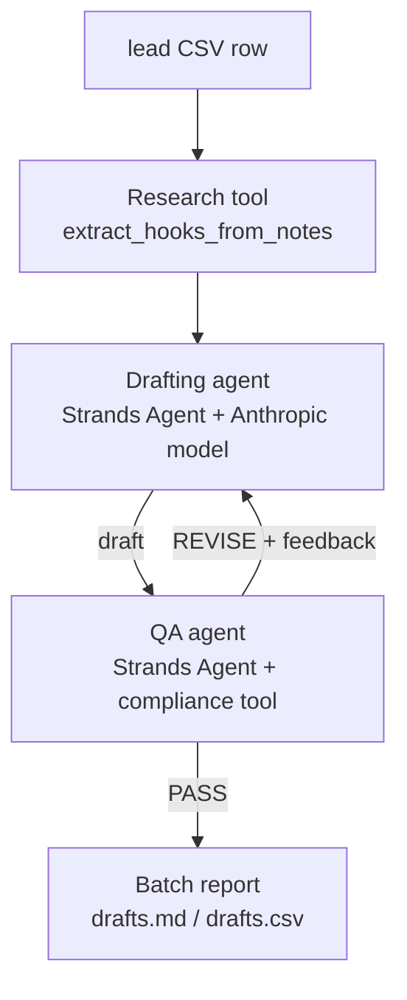

# WarmIntro

**An AI agent that turns a spreadsheet of cold leads into ready-to-send, personalized outreach — end to end, not just chat.**

Built for the [Agents for Humans Hackathon](https://agentsforhumans.devpost.com/) on the [Strands Agents SDK](https://strandsagents.com/) — **Professional Agents** track.

## The problem

Personalizing cold B2B outreach at scale is one of the most repetitive tasks in sales and business development: pull context on a lead, write a message that doesn't read like a mail-merge, check it isn't spammy or overpromising, and do that again for every row in the list. Most people either skip the personalization (and get ignored) or spend hours doing it by hand.

WarmIntro automates the whole loop — research hooks → draft → QA → revise — and hands back a batch of messages that are actually ready to paste into LinkedIn or an email client.

## What it does

Given a CSV of leads (`name, title, company, notes`), WarmIntro:

1. **Extracts personalization hooks** for each lead from whatever context you already have (a LinkedIn snippet, company news, or just their title/company).
2. **Drafts** a first-touch message and a short follow-up, following a specific outreach philosophy: warm, role-specific, curiosity-led, never pitchy, never over-promising (see `warmintro/voice_profile.py`).
3. **QA-reviews** every draft against objective rules (length, banned phrases, no unverifiable claims, ends with a low-effort question) *and* a subjective read on whether it's actually specific to that lead — and kicks it back for a rewrite (up to 2 rounds) if it fails either check.
4. **Outputs a batch report** (`output/drafts.md` and `output/drafts.csv`) with every message, the exact personalization hooks used for it, and its QA history, ready to send.
5. **Quantifies the impact**, not just the output: every run (CLI or Streamlit) reports pipeline time, QA revision rate, and an estimated time-savings figure against a stated manual-outreach benchmark (~15 minutes per lead to research, draft, and self-review a comparably personalized message) — so the value isn't just "here are some short messages," it's "here's how much of a real, repetitive workload this replaces." See `compute_impact_summary()` in `warmintro/pipeline.py` for the exact math and its stated assumption.

This is designed to be resold as a service: swap `warmintro/voice_profile.py` for a client's own tone, swap the research tool for a real enrichment API (Clay, Apollo, Bright Data), and the rest of the pipeline is unchanged.

## Architecture



- **Research tool** (`warmintro/tools/research.py`) — a plain-code tool (no LLM call) that turns raw lead fields into 2-4 concrete hook strings. Deterministic and free to run over long lists.
- **Drafting agent** (`warmintro/agents.py`) — a `strands.Agent` with the research tool attached, writing in a fixed voice profile.
- **Compliance tool** (`warmintro/tools/compliance.py`) — deterministic rule checks (length, banned phrases, overpromise patterns, ends with a question) the QA agent calls before adding its own judgment.
- **QA agent** — a second, independent `strands.Agent` that can't grade its own homework: it reviews the drafter's output against the compliance tool plus its own read on specificity, and either passes it or sends concrete feedback back to the drafter.
- **Orchestrator** (`warmintro/pipeline.py`) — plain Python that loops the above over every row in the input CSV and writes the final report. This is the "end-to-end, not just chat" part of the brief: you hand it a spreadsheet, you get back sendable drafts.

Any Strands-supported model provider works. `warmintro/config.py` picks the backend at runtime from `WARMINTRO_MODEL_PROVIDER` — **Anthropic API** directly, **Amazon Bedrock** (using standard AWS credential resolution — env vars, an AWS CLI profile, or an IAM role), **OpenAI**, or **Gemini** — with zero agent code changes when you switch. `agents.py` only ever calls `get_model()` (see [Strands' model provider docs](https://strandsagents.com/docs/user-guide/concepts/model-providers/)); this is a real, working example of that provider-agnosticism, not just a claim.

## Setup

```bash
git clone <this-repo>
cd warmintro
pip install -r requirements.txt
cp .env.example .env   # add your ANTHROPIC_API_KEY (or set up Bedrock — see .env.example)
```

By default WarmIntro calls the Anthropic API directly. To run it on Amazon Bedrock instead, set `WARMINTRO_MODEL_PROVIDER=bedrock` plus your AWS region/credentials (see `.env.example`) — no other setup change needed.

## Run the demo

### Option A — Streamlit UI (recommended for a live demo)

```bash
streamlit run app.py
```

Upload your own lead CSV or use the bundled sample, then watch each lead move through the drafting agent → QA agent loop live in the browser, with a downloadable `drafts.md` / `drafts.csv` at the end. Deploy this the same way as any Streamlit app (e.g. Streamlit Community Cloud) to get a public live-demo link.

### Option B — CLI

```bash
python run_demo.py --input data/sample_leads.csv --output output/
```

This runs the pipeline over the eight fictional sample leads in `data/sample_leads.csv` (spanning logistics, BD, partnerships, finance, sales ops, marketing, a founder, and procurement — deliberately varied roles so the personalization actually has to work, not just fill in a template) and writes `output/drafts.md` (human-readable) and `output/drafts.csv` (spreadsheet-ready). Swap in your own CSV with the same columns (`name,title,company,notes`) to run it over a real list.

### Architecture diagram

A rendered copy is at [`architecture.png`](architecture.png) (source: [`architecture.mmd`](architecture.mmd)) for anyone who wants the image file directly, in addition to the Mermaid diagram below.

## Why this matters (Potential Impact)

Personalized cold outreach at scale is a concrete, everyday pain point for sales teams, BD professionals, agencies, and freelancers — a problem area with real, active demand (outreach/lead-gen automation is one of the fastest-growing AI service categories on freelance platforms like Upwork in 2026). WarmIntro isn't a toy demo: the pipeline, voice-profile customization point, and enrichment swap-in point are all designed so it can go straight into production use for a sales team or be resold as a service.

## Roadmap / extension points

- Swap the research tool for a live enrichment API (Clay, Apollo, Bright Data, or Strands' own web-search community tools) instead of relying on pre-supplied notes.
- Move from direct Bedrock model calls to Amazon Bedrock AgentCore for managed, scalable execution.
- Add a per-client voice-profile config so one deployment can serve multiple outreach campaigns/clients at once.
- Direct CRM (HubSpot/Salesforce) read/write instead of CSV in/out.

## License

MIT — see [LICENSE](LICENSE).
